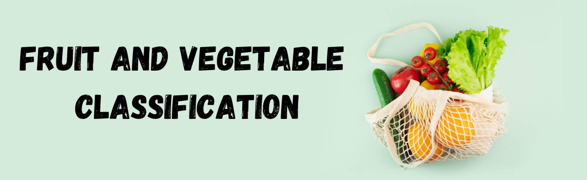

# Fruits and Vegetables Recognition 🍎🥕

This project implements an image classification system for identifying fruits and vegetables. Using a Convolutional Neural Network (CNN) for feature extraction and classification, it provides accurate predictions for a range of fruits and vegetables. The project also features a user-friendly **Streamlit** interface for real-time image uploads and predictions.

## Watch the Video 📺

[](https://youtu.be/juvY1NHjD8o)


---

## Features ✨
- Train and deploy a CNN model for fruit and vegetable classification.
- Provide real-time predictions via an intuitive **Streamlit-based web app**.
- Evaluate model performance on diverse datasets for robust results.
- Customize predictions with a simple and attractive frontend interface.

---

## Dataset 📊
This project uses the **Fruits and Vegetables Image Dataset** available on [Kaggle](https://www.kaggle.com/datasets/kritikseth/fruit-and-vegetable-image-recognition/data), which includes images of various fruits and vegetables in high quality. Ensure you download and preprocess the dataset before training the model.

---

## Installation 🛠️

### Requirements 📋
Make sure you have the following dependencies installed:

- Python 3.7+
- TensorFlow / Keras
- NumPy
- Matplotlib
- Pillow
- Streamlit

### Setup ⚙️
1. Clone the repository:
```bash
git clone https://github.com/DataScientist00/Fruits-and-Vegetables-Recognition-Project
cd Fruits-and-Vegetables-Recognition-Project
```

2. Install the dependencies:
```bash
pip install -r requirements.txt
```

3. Prepare your dataset:
   - Download the Fruits and Vegetables dataset from [Kaggle](https://www.kaggle.com/datasets/kritikseth/fruit-and-vegetable-image-recognition/data).
   - Organize the dataset into a train/test folder structure.

4. Ensure that the `cnn_model.h5` file is placed in the project directory for predictions.

---

## Project Structure 📂
Below is the list of files included in this repository:

- **`app.py`**: The Streamlit application for user interaction.
- **`banner.png`**: The image displayed on the homepage of the Streamlit app.
- **`cnn_model.h5`**: The pre-trained CNN model file for predictions.
- **`fruits-and-vegetables-classification.ipynb`**: Jupyter Notebook for training and evaluating the CNN model.
- **`requirements.txt`**: List of dependencies required to run the project.

---

## Usage 🚀

### Running the Streamlit Application
To launch the application, execute the following command in your terminal:
```bash
streamlit run app.py
```

This opens the web application in your default browser, where you can:
- Upload an image.
- View the predicted label (fruit/vegetable name).
- Explore an engaging interface with real-time predictions.

### Training the Model
To train the model from scratch, open the `fruits-and-vegetables-classification.ipynb` notebook and follow these steps:
1. Load the dataset and preprocess it for training.
2. Define and compile a CNN model architecture.
3. Train and evaluate the model on the training and validation datasets.
4. Save the trained model as `cnn_model.h5` for deployment.

---

## Project Architecture 🏗️

1. **Data Preprocessing**:
   - Images are resized and normalized.
   - Split into training, validation, and test sets.

2. **Model Training**:
   - A CNN is defined with multiple convolutional and pooling layers.
   - The model is trained using categorical cross-entropy loss and Adam optimizer.

3. **Model Deployment**:
   - The trained model is integrated into the Streamlit app for real-time predictions.

4. **Frontend Interface**:
   - Streamlit provides a lightweight yet powerful web app to upload and classify images interactively.

---

## Example Output 🖼️📝

### Input Image


### Predicted Label
"Grapes"

---

## Contributing 🤝
Contributions are welcome! Please fork the repository, create a feature branch, and submit a pull request.

---

## Acknowledgements 🙌
- [TensorFlow](https://www.tensorflow.org/) - Machine Learning Framework
- [Streamlit](https://streamlit.io/) - Frontend Framework for Machine Learning Applications
- [Fruits and Vegetables Dataset](https://www.kaggle.com/) - Source of Dataset

---

## 🚀 Thanks

**If you found this project useful, leave a ⭐ on the repository!**

```bash
Author: DataScientist00
Data Scientist
Email: nikzmishra@gmail.com
